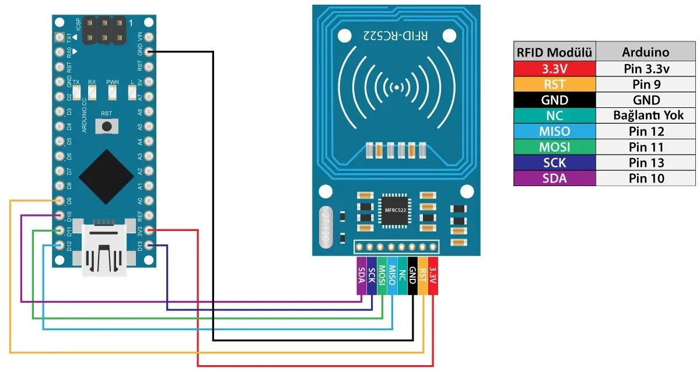
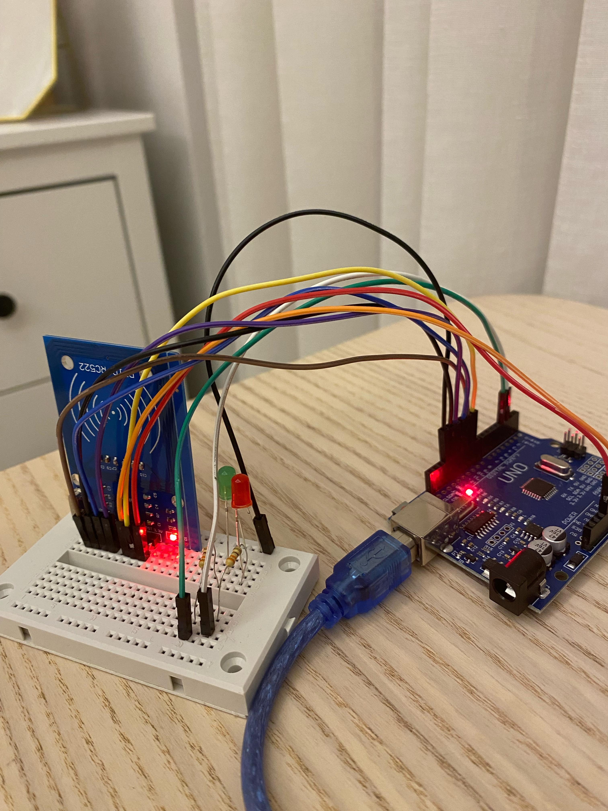
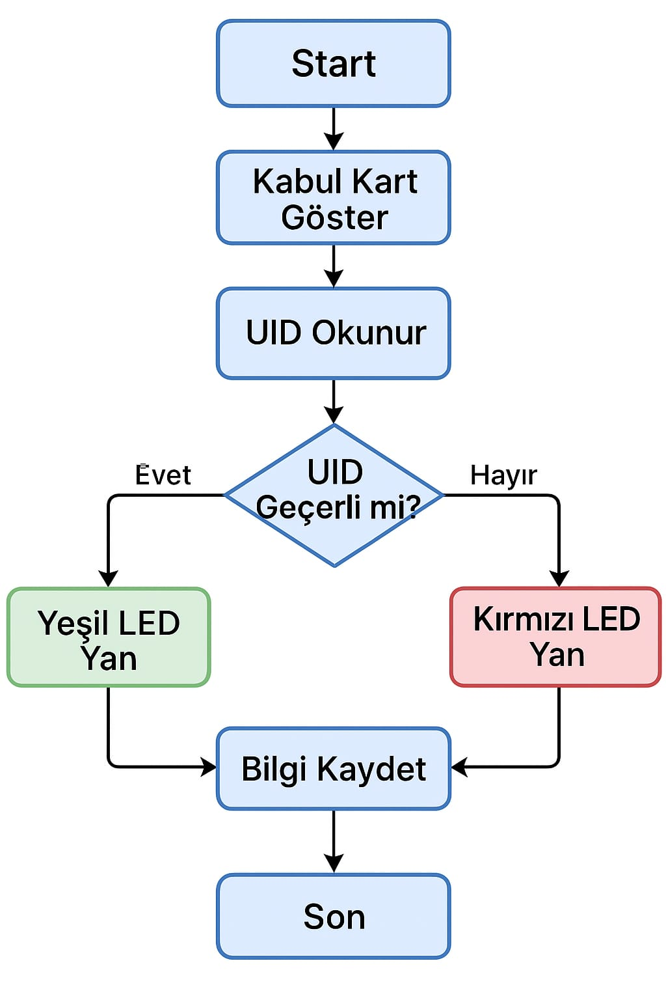
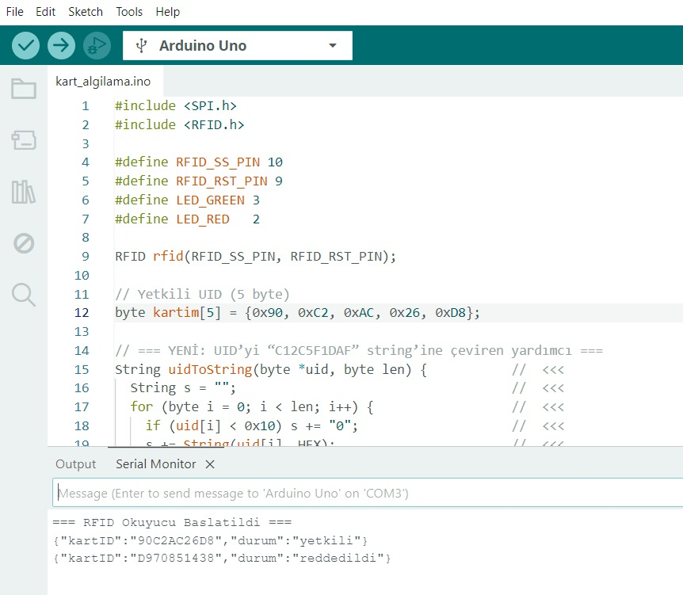
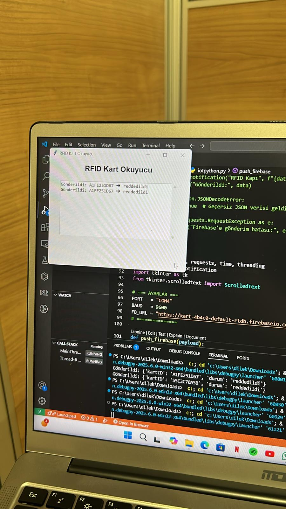
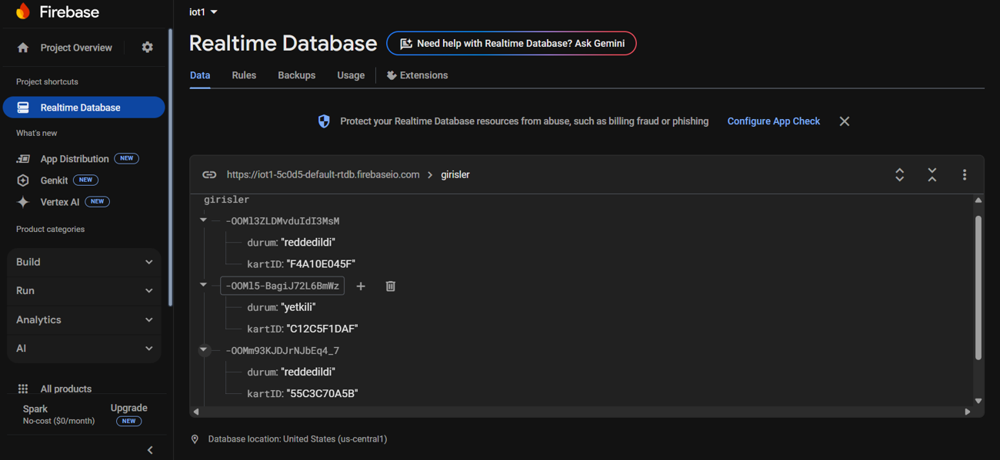
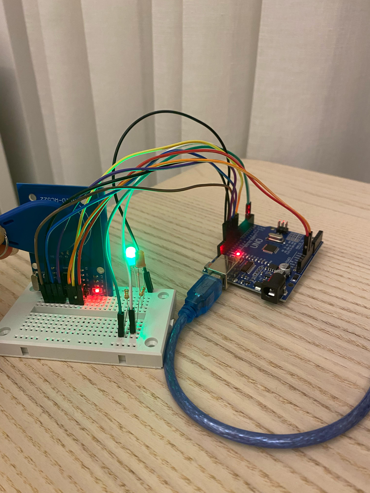
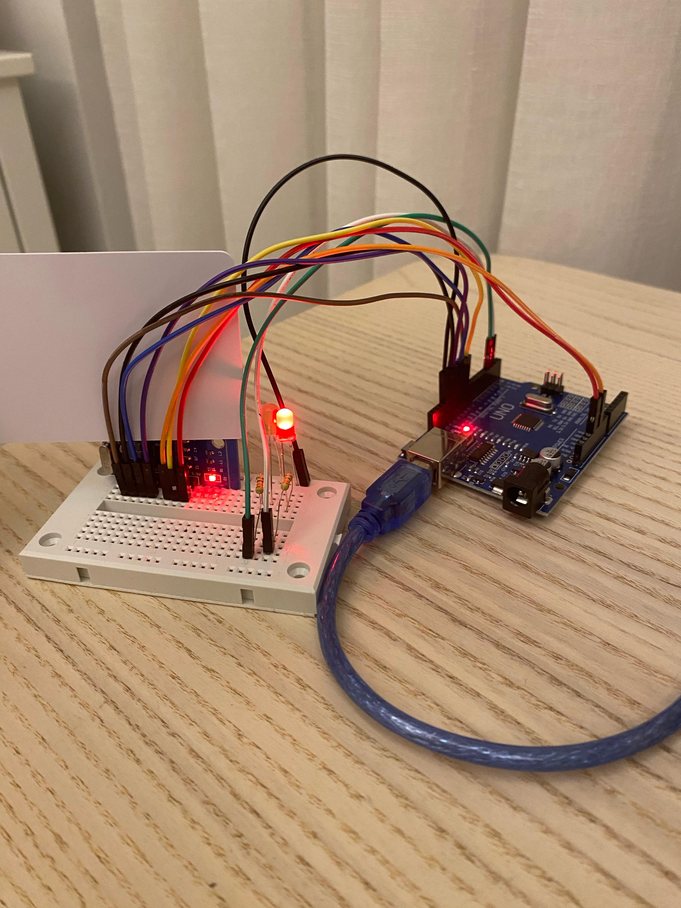

# 🔐 Ara Rapor

## 1. Proje Konusu (Kısa)
Bu proje, Arduino UNO, RC522 RFID kart okuyucu ve Firebase kullanılarak geliştirilen bir akıllı kapı kilidi sistemidir. Kullanıcılar RFID kartları ile kimlik doğrulaması yapar, geçerli kartlar için yeşil LED yanar ve bilgiler Firebase veri tabanına kaydedilir. Sistem, Python GUI arayüzü ile masaüstü bildirim ve loglama sağlar.

## 2. Özet (Kısa)
Projenin bu aşamasında:
- RFID kart UID’si okuma,
- LED ile geçerli/geçersiz kart ayrımı,
- Arduino ve Python arasında seri port iletişimi,
- Python GUI ile kullanıcı arayüzü,
- Firebase veri tabanına giriş bilgilerini kaydetme işlemleri tamamlanmıştır.

## 3. Kullanılan Yöntemler
**Donanım:**  
- Arduino UNO  
- RC522 RFID Modülü  
- RFID kart ve anahtarlık  
- LED (yeşil, kırmızı), direnç, breadboard, jumper kablolar  

**Yazılım:**  
- Arduino IDE (C++ kodları)  
- Python (GUI + veri alma + bildirim + Firebase)  
- Firebase Realtime Database  

**Kütüphaneler:**  
- pyserial, requests, plyer, tkinter

**Metodoloji:**  
RFID karttan UID alınır → JSON formatına çevrilir → Python’a iletilir → Firebase’e kaydedilir → GUI'de loglanır → masaüstü bildirimi verilir.

## 4. Yapılan Çalışmalar ve Görselleri
- 📡 RFID karttan UID alma ve eşleştirme başarıyla uygulandı.
- 🔴🟢 LED ile geçerli/geçersiz kart ayrımı gözlemlendi.
- 💻 Python GUI arayüzü geliştirildi ve log sistemi kuruldu.
- ☁️ Firebase ile veri bağlantısı kurularak veri gönderimi sağlandı.
- 📷 Görseller:
  - 
  - 
  - 
  - 
  - 
  - 
  - 
  - 

## 5. Elde Edilen Sonuçlar
- Kart UID'leri başarıyla okunmuş ve eşleştirilmiştir.
- LED geri bildirim sistemi çalışır durumdadır.
- Firebase veri tabanı bağlantısı kurulmuş ve veri gönderimi başarılıdır.
- Python GUI ve masaüstü bildirim sistemi senkronize şekilde çalışmaktadır.

## 6. Karşılaşılan Sorunlar ve Çözümler

| Sorun | Açıklama | Çözüm |
|-------|----------|--------|
| COM Port Çakışması | Arduino IDE açıksa Python portu kullanamaz | Serial Monitor kapatılarak Python başlatıldı |
| JSON Format Hataları | Arduino’dan gönderilen JSON düzgün formatlanmamıştı | Kod güncellendi, veri yapısı düzeltildi |
| Donanım Temassızlığı | Breadboard bağlantılarında temassızlık yaşandı | Tüm bağlantılar gözden geçirildi ve sabitlendi |
| Firebase Bağlantısı | Yanlış URL ya da internet bağlantısı sorun çıkardı | URL kontrol edildi, internet erişimi sağlandı |
| GUI Donması | Seri okuma GUI thread'inde olunca arayüz kilitlendi | Veri okuma işlemi ayrı bir thread'e taşındı |

## 7. Projenin Devamında Yapılacaklar

Proje, öneri raporunda yer alan tüm temel gereksinimleri başarıyla yerine getirmiştir. Bu noktadan itibaren odak, sistemin işlevselliğini ve kullanıcı deneyimini artıracak yeni özelliklere yönelmiştir:

### 🔊 1. Buzzer Entegrasyonu ile Sesli Uyarı

### 💻 2. Gelişmiş Python GUI Arayüzü

### 🕒 3. Zaman Bazlı Giriş Kontrolü

### 👤 4. Kullanıcı Yetkilendirme Sistemi

### 🔈 5. Python ile Bilgisayar Üzerinden Sesli Bildirim

---
